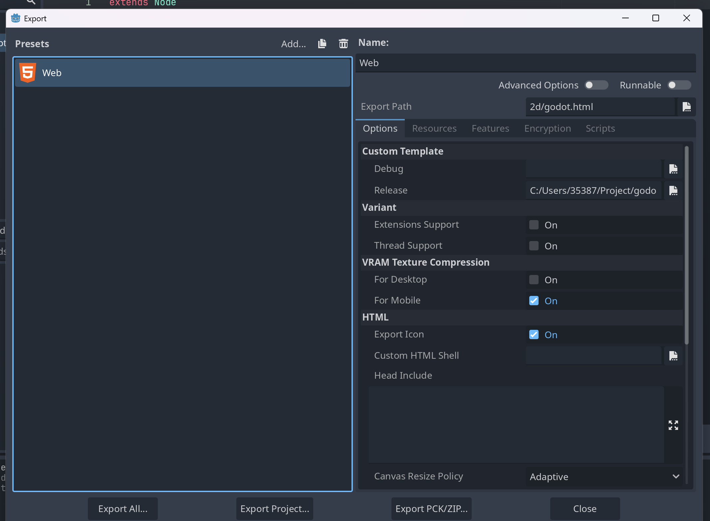
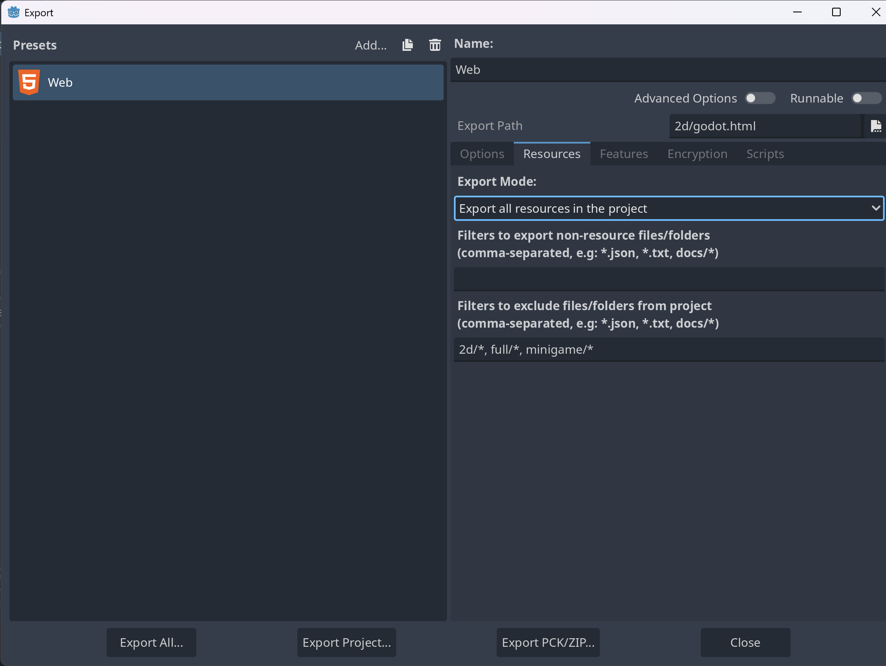
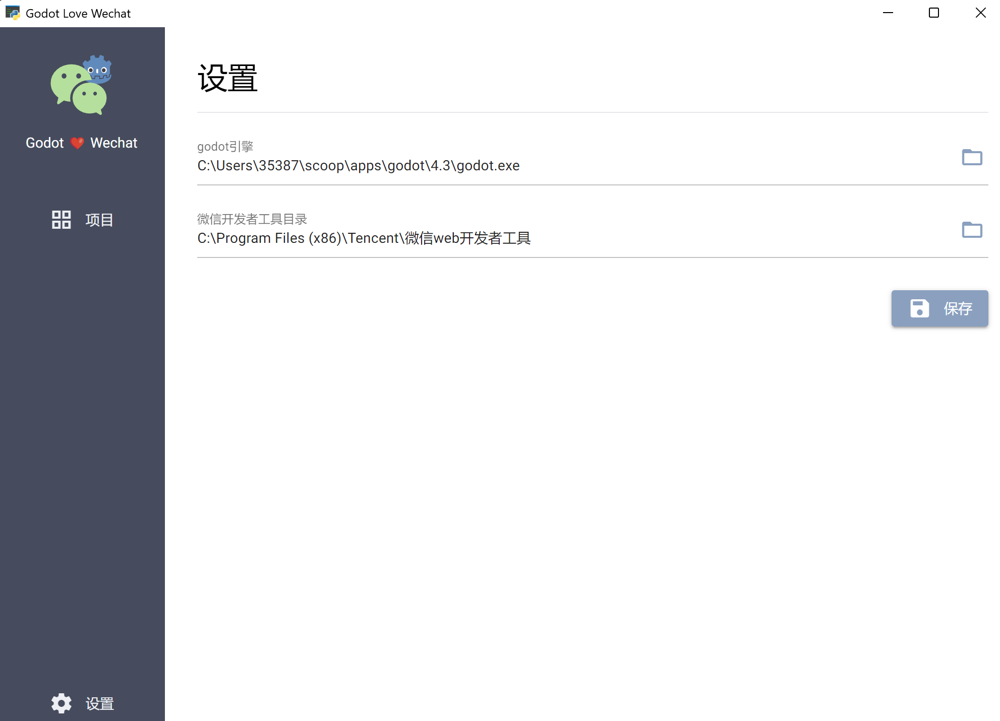
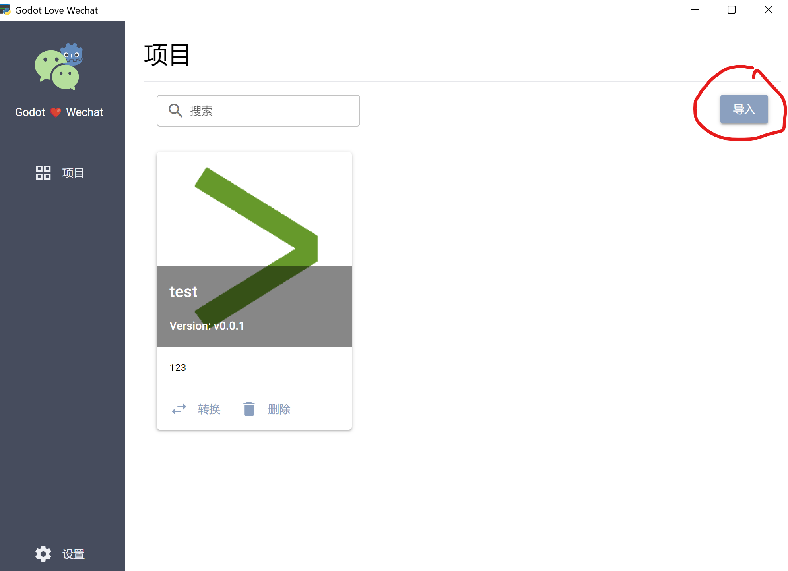
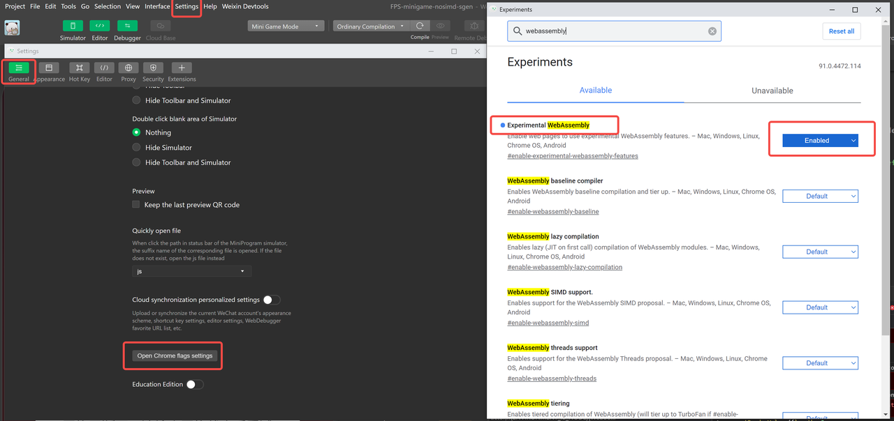
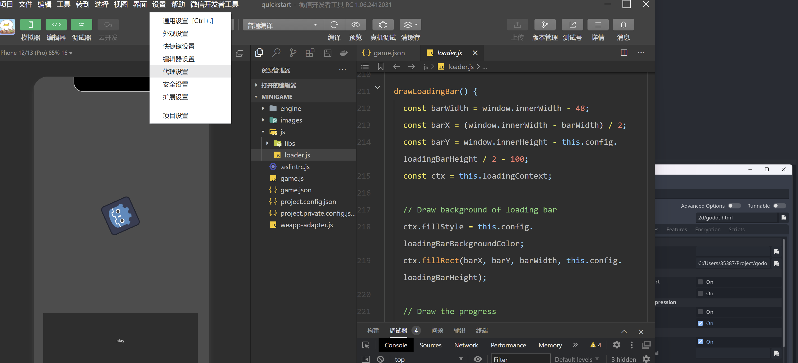
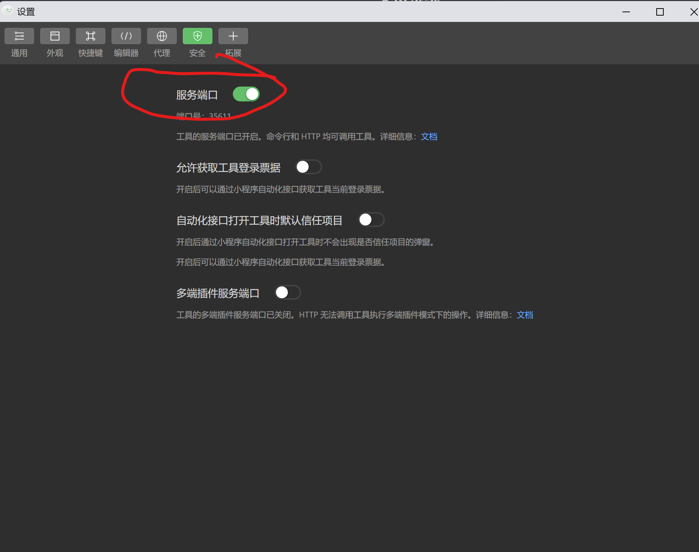

<div align="center">
  <h1>Godot小游戏转换工具</h1>
  </img>
</div>
<br/>

这是一个将Godot4.3 将WEB适配为微信小游戏的小工具，自行编译了Godot4.3的WASM，将ScriptProcessor的音频废案代码重新添加回来，使得在微信小游戏当中能够播放声音,并且受控于Godot的音频总线。
并且增加了将wasm的内存文件系统的用户文件夹定时拷贝至微信小游戏的文件系统

裁剪或关闭了以下模块：

- 高级文本服务
- 关闭了webrtc
- 关闭了webxr
- 关闭了Openxr
- 关闭了javascript_eval: 本来小游戏就不让eval

## 支持系统

- Windows 11 因为用了webview2的依赖
- Macos (等待开发)

## 如何使用

### Godot编辑器设置

打开Godot的导出设置并添加Web导出


将你不需要被打包的文件夹或者文件进行过滤, 在Filters to exclude files里面



### 导出小工具设置

打开导出工具


设置godot引擎目录，和微信开发者工具的地址



打开项目列表导入你的项目



点击转换


单击导出即可

### 微信开发者工具设置

**重点！！！**，想要微信开发者工具预览小游戏你必须做以下设置
1. 打开开发者工具目录中的`code\package.nw\package.json`并进行编辑,并在chromium-args添加--experimental-wasm-eh标志，并重启电脑！

   
2. 打开实验性wasm设置，新版本应该都打开了


3. 导入导出的项目后在安全设置-安全设置中打开服务端口，这样你在导出工具里直接可以按预览按钮即可预览



4. 在设置/通用设置中确保打开GPU加速


5. 确保右边项目详情把这些都打开


## 常见问题
1. 打开报错
```
CompileError: WebAssembly.instantiate(): unexpected section (enable with --experimental-wasm-eh) 
@+58331(env: Windows,mg,1.06.2409140; lib: 3.6.6)
```
参考上面的微信开发者工具设置，需要你修改下微信开发者工具，后面好像小游戏开发者工具自带

2. 打开报错类似这样
```
godot.js? [sm]:483 USER ERROR: Cannot get class 'SubViewportContainer'.
godot.js:6883 USER SCRIPT ERROR: Parse Error: Could not find base class "RichTextLabel".
```
精简版导出模板去除了高级gui，如果你项目使用了高级GUI,那么就会导致这样的错误，可以使用完整版模板导出，**注意，导出工具只有在第一次导出时会将整个模板导出，后续只会导出pck，所以如果发生这样的问题，请将导出目录下的所有文件删除，或者删除game.json**

3. 如何调用微信的api工具？

参考文档：https://docs.godotengine.org/en/stable/classes/class_javascriptbridge.html 使用godot的js bridge 来进行，也可以自己尝试封装一些sdk
目前来说，对于http请求，websocket这些都可以直接使用godot内置的工具，都进行了适配，如果不行就参考文档通过jsbridge进行封装
